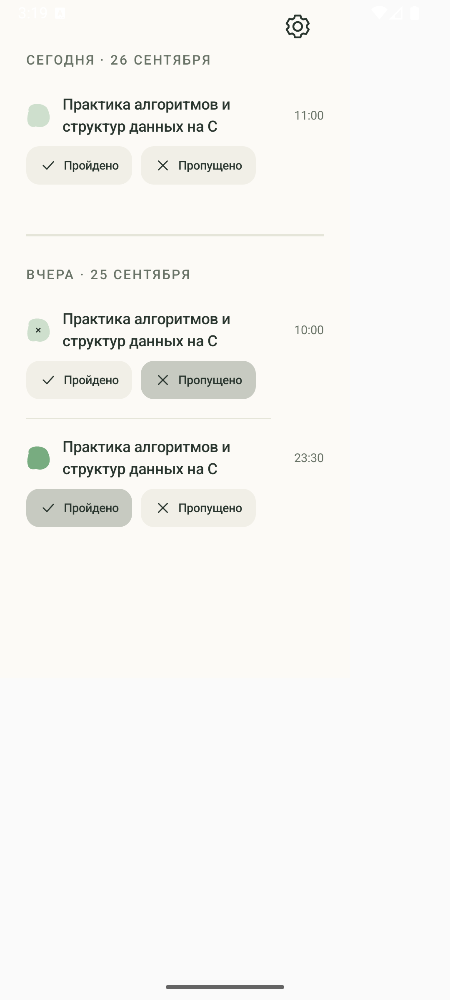
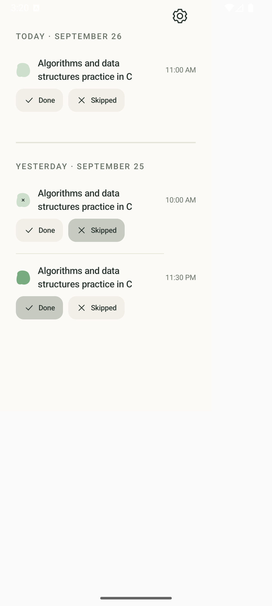

# R04 — отметка вчерашнего занятия

Пользователь может менять результат занятия с локальной датой начала сегодня или
вчера. Позавчерашние, будущие занятия и занятия завершённого курса остаются только
для просмотра. Проверка даты общая для `SessionDetails.canEdit` и транзакции записи
результата.

На экране «Занятия» появились два одинаково выровненных блока:
«Сегодня · дата» и «Вчера · дата». Каждый список прокручивается отдельно; между
блоками показан полноширинный разделитель толщиной 2 dp с увеличенными до 28 dp вертикальными отступами;
линии между отдельными занятиями выровнены слева по кнопкам и укорочены справа. Пустые блоки
показывают «Занятий нет»
и «Занятий не было». Календарь
оставлен без действий по явному уточнению пользователя. «Пройдено» у курса с
темами открывает выбор тем, без тем записывает результат сразу; «Пропущено» и
снятие отметки работают непосредственно в строке занятия. Вертикальные отступы в подложках этих
кнопок уменьшены примерно на треть.
В строке занятия сначала показана клякса, затем название курса с переносом длинного текста, а время выровнено по правому краю. Шрифты не изменены.

Автоматический перевод прошлых `PENDING` в `SKIPPED` сохранён. Вчерашний пропуск
можно оставить, снять или исправить на `DONE`; `completionDate` выбранных тем
остаётся epoch day начала занятия, даже если результат задан после полуночи.

## Проверки

- `:app:assembleDebug`, `:app:assembleDebugAndroidTest`, `:app:testDebugUnitTest`, `:app:lintDebug` — успешно на JDK 17.
- API 36, `SessionResultRepositoryTest` — 8/8: today/yesterday, запрет позавчера и будущего, 23:30→01:00, отсутствие окончания, автоматический пропуск, повторное сохранение, граница года и смена пояса.
- API 36, `SessionScreenTest` — 12/12: редактирование и отмена вчерашнего занятия, сохранение даты начала, внешний переход по `sessionId`, read-only для позавчера/будущего.
- API 36, `CalendarTodayScreenTest` — 6/6: фильтр дат, завершённый курс, смена суток, независимая прокрутка, одинаковое выравнивание и два пустых состояния.
- API 36, `CalendarIntegrationTest` — 1/1: календарь остался read-only для будущего занятия.
- API 36, `TodayVisualReviewTest` — 2/2; сохранены RU/EN-снимки 320 dp.
- Повторяемое заполнение эмулятора — 2/2, существующие данные сохранены.

Объединённый запуск нескольких Compose-классов дал три тестовых сбоя
`Choreographer: current thread must have a looper` в `SessionScreenTest` и одну
устаревшую проверку языка заголовка. Проверка языка исправлена; затронутые классы
затем прошли отдельными целевыми запусками полностью. Полный instrumentation-набор,
Android 13 и реальное ожидание уведомления о результате после полуночи не запускались.
Путь уведомления использует тот же проверенный внешний `sessionId`; фактическая
доставка exact alarm остаётся областью R03.

## Снимки

