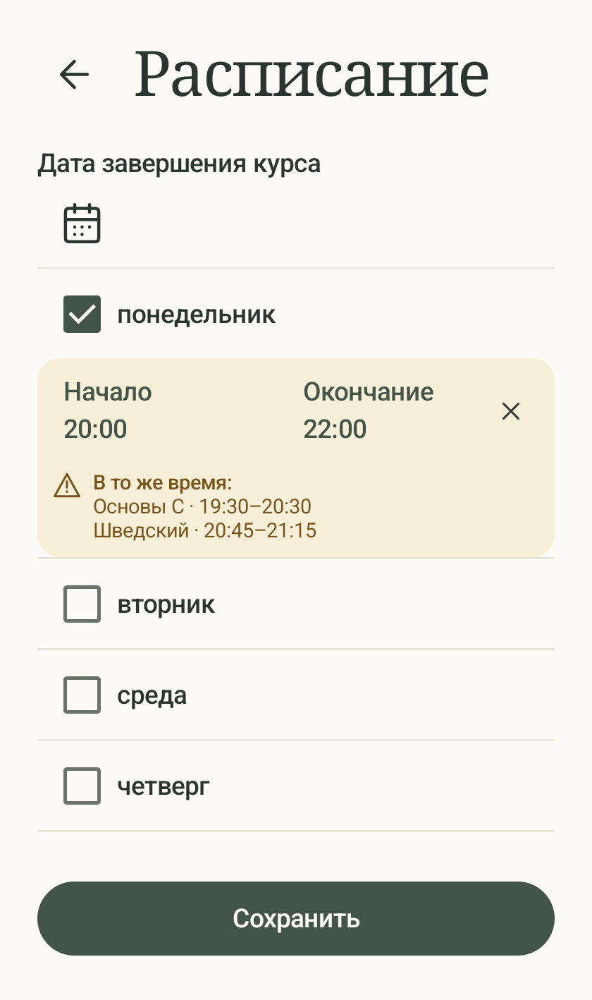
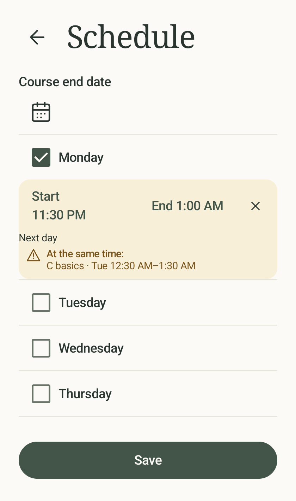

# Пересечения расписания — 2026-10-01

В форме расписания добавлены янтарная подсветка, значок предупреждения и подпись
«В то же время:» / «At the same time:». Ниже только название курса и его интервал.
Крестик 16 dp с обычной областью нажатия IconButton убирает окончание.
Сохранение с пересечениями разрешено; дополнительного подтверждения нет.

Расчёт — `domain/ScheduleOverlap.kt`, данные — `TrackerRepository.observeOccupiedSchedules`.
Недельные правила сравниваются с учётом сроков действия и соседних дней, включая
границу недели. Собственный курс, завершённые, приостановленные и исчерпанные
исключаются. Не заданное окончание считается часом до полуночи только для проверки
занятости; NULL в базе и время вопроса о занятии не меняются. Изменение других курсов
обновляет предупреждения в уже открытой форме. Миграция БД не требуется.

Согласованный макет сохранён в `design/mockups/schedule-overlaps.html`,
редактируемый исходник — `design/mockups/sources/schedule-overlaps.html`.

## Проверки

Из `tracker-app/`, JDK 17:

```sh
./gradlew :app:assembleDebug :app:assembleDebugAndroidTest :app:testDebugUnitTest :app:lintDebug --console=plain
```

Сборка приложения и тестов успешна. 21 JVM-тест без ошибок, включая 6 новых
проверок интервалов и границ дат. Lint: 0 ошибок, 32 предупреждения.
После добавления визуальных проверок `:app:assembleDebugAndroidTest` повторён успешно.

Установка и повторяемое заполнение: `sh scripts/seed-emulator.sh` — 2 теста OK.
Существующие данные сохраняются; приложение запускается на API 36.

Целевой инструментальный прогон:

```sh
adb shell am instrument -w -e class com.utbildning.tracker.ui.ScheduleScreenTest,com.utbildning.tracker.data.ScheduleRepositoryTest,com.utbildning.tracker.ui.ScheduleOverlapReviewTest com.utbildning.tracker.test/androidx.test.runner.AndroidJUnitRunner
```

Итог: **25 тестов OK** на API 36: ScheduleScreenTest — 9, ScheduleRepositoryTest — 14,
ScheduleOverlapReviewTest — 2. Проверены сохранение при предупреждении, удаление
окончания, восстановление черновика, обновление по данным репозитория и прежние
сценарии редактирования расписания.

Сохранены 12 снимков RU/EN на 320 × 540 dp в `screenshots/`.
Индексы: 0 — частичное пересечение; 1 — несколько курсов; 2 — час по умолчанию;
3 — ограничение полуночью; 4 — явное ночное занятие; 5 — стык без предупреждения.
Вручную просмотрены ru_1, ru_2, ru_3, en_4 и en_5: текст и крестик не перекрываются,
кнопка сохранения закреплена, длинный список дней прокручивается.




Android 13 и полный набор инструментальных тестов не запускались.

## Исправление верстки и проверка примера пользователя

Подписи «Начало»/«Окончание» возвращены к прежнему стилю TextButton:
название и время — один Text в одну строку, без labelSmall и отдельных колонок.
Убраны веса, растягивавшие кнопки, уменьшены горизонтальные отступы кнопок. При недостатке ширины переносится целая кнопка
окончания вместе с крестиком, а не отдельные части времени.

Сверена копия БД работающего эмулятора: у «Разговорной практики» четверг 19:00,
у «Шведский · A2» четверг 20:30, оба окончания NULL. Для черновика со скриншота
чт 11:00 → пт 05:30 оба пересечения корректны: расчётные интервалы других курсов
19:00–20:00 и 20:30–21:30. У «Пейзажей» 09:00–10:00 — пересечения нет.
В сохранённом расписании «Задачи по C» четверг 11:00–12:30: это отличается от
черновика на скриншоте. По снимку нельзя утверждать, что 05:30 было сохранено.
Алгоритм пересечений не менялся: ошибка в данном примере не подтвердилась.

Добавлен тест на этот набор расписаний и отсутствие вечерних пересечений для
11:00–17:30, 11:00–12:30 и начала 11:00 без окончания. Ещё один тест сравнивает
1000 воспроизводимых комбинаций правил и сроков с явным перебором календарных
интервалов. UI-проверка RU/EN дополнена сценой со скриншота и проверкой того,
что подпись и время образуют один текст без переноса/обрезки.

Сборка/lint успешны; 23 JVM-теста прошли. Поведенческий ScheduleScreenTest — 9/9.
Проверка верстки дополнительно проверяет фактические границы каждого символа:
у Compose с softWrap=false внутренняя ширина абзаца может быть больше текста,
поэтому один hasVisualOverflow даёт ложное срабатывание. Для 320 dp также
проверяется общий ряд начала/окончания и видимость крестика.
Финальные RU/EN-проверки — 2/2 OK (14 состояний/снимков). Новые снимки заменили прежние; индекс 6 — пример пользователя с четвергом 11:00 → 05:30. Просмотрен итоговый ru_6: обе кнопки и крестик в одном ряду. Сборка повторно установлена с сохранением данных. Android 13 и полный инструментальный набор не запускались.


Уточнение добавления конца: «Добавить конец» открывает системный выбор времени
с предложением +1 час (не позднее полуночи). Отмена сохраняет отсутствие конца,
подтверждение применяет выбор. Подпись сокращена до «Конец»; начало слева,
конец и соседний крестик справа. Сборка APK и тестового APK успешна.
11 поведенческих и 2 RU/EN визуальных теста прошли на API 36, включая новые
проверки отмены/подтверждения и предложения полуночи. Все 14 снимков обновлены;
ru_6 просмотрен. APK установлен с сохранением данных.

Последнее уточнение: дата закреплена над отдельной прокруткой дней и отделена линией. Убраны вертикальные отступы блока времени, начало выровнено с галочкой, промежуток до конца ограничен 36 dp и сжимается на узком экране. assembleDebug и 2 RU/EN визуальных теста (14 сцен) прошли; снимки обновлены, ru_6 просмотрен. APK установлен без удаления данных.

Подписи обновлены на «Окончание» и «Дата завершения курса». Время допускает перенос под подпись; пробел внутри локализованного времени неразрывный. Крестик имеет зарезервированную ширину. Зазор между галочкой и названием дня уменьшен на 5 dp (примерно треть). Сборка и 2 RU/EN проверки прошли, снимки обновлены.

«Окончание» и «Добавить окончание» помещены в общую колонку с одинаковым левым отступом. Ширина колонки не зависит от наличия окончания; перенос времени сохранён. Сборка и 2 RU/EN визуальных теста прошли, снимки обновлены.
